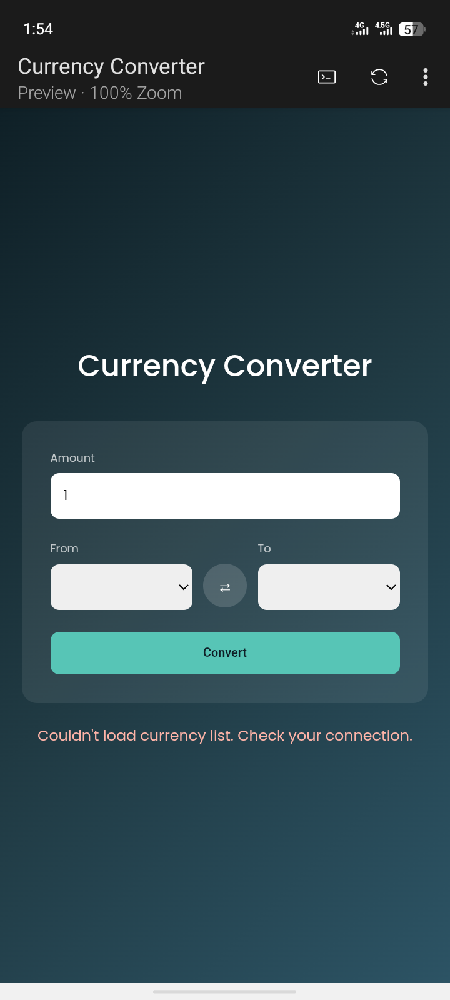

# Currency Converter

A live currency converter built with HTML, CSS, and JavaScript, using real-time exchange rates from the Frankfurter API.

  ## Preview 

## Links

Solution link: [https://github.com/DevAdeh/Currency-Converter..git]

Live link: [https://currency-converter-umber-mu-39.vercel.app/]

## Features
- Converts between a full list of world currencies
- Live exchange rate shown alongside the converted amount
- One-click swap between the "from" and "to" currencies
- Loading and error states for a smoother experience

## How it works
On load, the app fetches the full list of supported currencies and uses it to populate both dropdown menus dynamically. When the form is submitted, it fetches the current exchange rate between the selected currencies and calculates the converted amount, along with the effective per-unit rate.

## Tech used
- HTML
- CSS
- JavaScript (fetch API, async/await, dynamic dropdown generation)
- [Frankfurter API](https://frankfurter.dev/) (free, no API key required)

## How to use
1. Clone or download this repo
2. Open `index.html` in your browser
3. Enter an amount, choose your currencies, and hit Convert

## Project structure

currency-converter/
├── index.html
├── style.css
├── script.js
└── README.md 

## Author
Adeola Ejikunle —
[GitHub](https://github.com/DevAdeh)